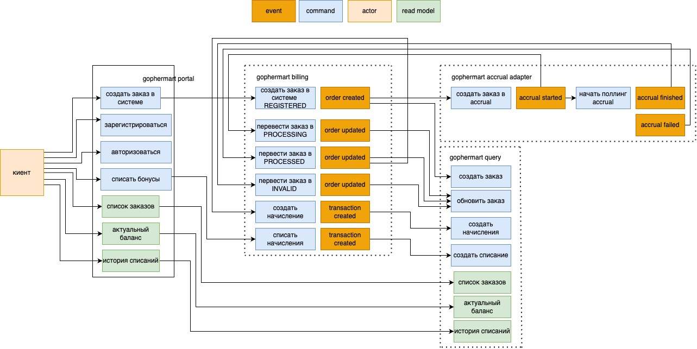
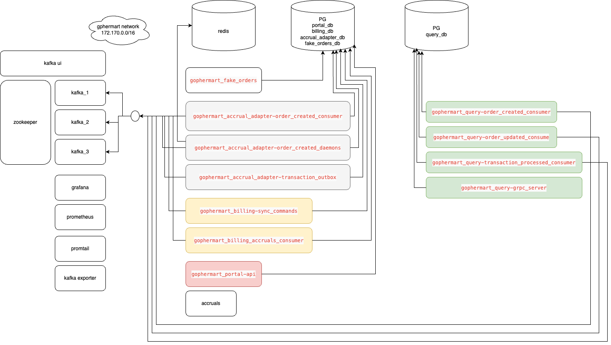

# Gophermart

- [Портал]()
- [Биллинг]()
- [Сервич агрегации данных]()
- [Сервис - адптер accrual]()
- [Сервис для генерации фейковых заказов]()

### Event storming



Взаимодействия с `Gophermart` реализовано через rest api. 

После успешной легистрации/авторизации пользователь может создать заказа(запустить процесс начисления бонусов). Для того чтобы это сделать, необходимо узнать свой номер заказа

```bash
# в ответе будет текст с номером заказа
# номер заказа проходит проверку алгоритмом Луна

curl --location 'http://51.250.2.8:8060/api/order'
```

Далее пользователь отправляет запрос в портал

```bash
curl --location 'http://51.250.2.8:123/api/user/orders' \
--header 'Content-Type: application/json' \
--header 'Authorization: ••••••' \
--data '{
    "number": "849637274299530"
}'
```

Портал сериализует сообщение в бинарный формат `Protofuff` и отправет по grpc в биллинг.

При получении запроса, биллинг сохраняет в базе заказ(в состоянии NEW) и соответсвующее событие - `order_created`.

Сервис `gophermart_billing` состоит из нескольких процессов, помимо двух grpc серверов, в нем есть консьюмер и демон. Демон полит базу на наличие необработанных событий, после чего паблишит их в соответстующие топики. Например событие `order_created` попадает в топик `order_created`.

Как видно на схеме, сообщение из топика `orded_created` попаадет сразу в два сервиса:

- Консьюмер сервиса `gophermart_query` сохраняет полученное сообщение в таблицу пришедних событий. Отдельный демон полит данные из этой таблицы и обрабатывает их. В данном случае он создает заказ в базе. Теперь пользователь может отправить запрос на получение списка заказов и увидеть свой заказ списке: 

```
curl --location 'http://51.250.2.8:123/api/user/orders' \
--header 'Authorization: ••••••' \
--data ''
```
- Консьюмер сервиса `gophermart_accrual_adapter` получает сообщение, сохрает его в таблицу с событиями. Отдельный демон полит данные из этой таблицы. Далее происходит процесс регистрации заказа в системе расчет баллов `acrual`.

  После этого в очередь `redis` сохраняется задача на проверку статуса заказа, а в таблицу с событиями - событие `acrual_started`. 
  
  На эту очередть подписан отдельный процесс. При получении задачи из этой очереди, воркер отправляет запрос в `acrual`. 
  
  Если стоимость посчитана - в таблице с событиями  воркер создает запись `accrual_finished`.
  
  Если сервис вернул ошибку - в таблице с событиями  воркер создает запись `accrual_failed`.
  
  Если сервис вернул сообщение о превышении лимитов запросов, воркер засыпает на необходжимое время, после чего кладет задачу обратно в очередь для перезапуска
  
  Если сервис не закнчил считать стоиомсть, воркер кладет задачу обратно в очередь


Консьюмер сервиса `gophermart_billing` полит топик с событиями `accrual`. При при получении сообщения, записывает его в таблицу входящих сообщений и запускает его обраблотку. Каждое такое событие переводит заказ в конечное состояние - `INVALID`, `PROCESSING`, `PROCESSED`. За эту логику отвечает стейт машина.

После смены состояния заказа, `gophermart_billing` паблишит соовтетсвующее событие в топик `order_updated`. Эти события случает консьюмер `gophermart_query` и обновляет состояния заказов.

При успешном начислении баланса и переходе заказа в состояние `PROCESSED`, в биллинге создается запись о начислении для данного заказа. Это сообщение стримится в топик `transaction_processed`. 

Если пользователь выполнил операцию списания средств за заказ, в биллинг создается запись о списании для выбранного заказа. Это сообщение так же стримится в топик `transaction_processed`. 

### Cхема данных


### Компоненты системы

